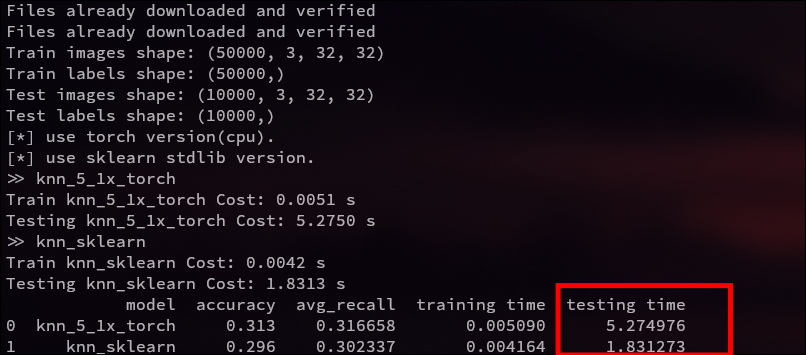

# Tasks

KNN的各项探究将在CIFAR-10分类数据集上进行。探究内容包括：

- KNN的手动实现。
- KNN的距离计算方式（循环，整批并行，批次并行）的计算效率。
- 基于不同计算框架的KNN效率，包括：numpy, torch-cpu, torch-gpu 。
- KNN在K=5折交叉验证下参数k的选择。
- 查看某个测试样例的k个邻居是什么，有什么共同特点，以及为什么会把他们归为邻居。

## task1 

- 任务：继承Clfs类，实现KNNClf，并与sklearn的KNN(需继承Clfs接口方便执行)进行对比。为了方便，可以等量减少数据，比如把训练集和测试集shuffle之后减少10倍。
- 基本参数：
    - `k = 5`
    - `distance = 'manhattan'`
    - `algorithm = 'brute'`
- 指标：
    - 代码测试时间。
    - 准确率和召回率。

在CPU环境的torch结果如下：

这里我们是在数据集`train: 5000, test: 1000`的情况下做的，且都先进行了shuffle，再进行的分割 。  
可以看到自己实现的和官方库的差距，即使我们使用torch-cpu的框架也进行了多线程整批次优化，但是依然无法达到和标准库一样的效果，原因有待考察。

## task2

- 任务：
    - 对于knn的距离计算，实现批次循环计算。
    - 同时基于两种框架对数据的计算进行实现：numpy和pytorch 。
