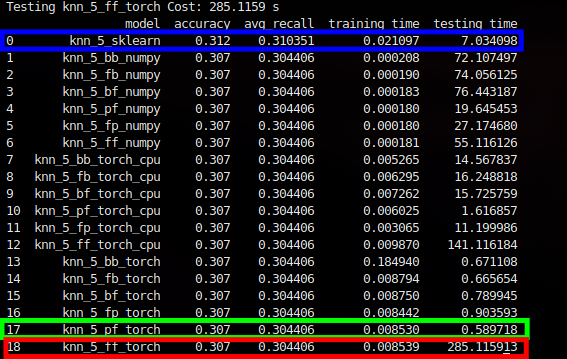

# Tasks

KNN的各项探究将在CIFAR-10分类数据集上进行。探究内容包括：

- KNN的手动实现。
- KNN的距离计算方式（循环，整批并行，批次并行）的计算效率。
- 基于不同计算框架的KNN效率，包括：numpy, torch-cpu, torch-gpu 。
- KNN在K=5折交叉验证下参数k的选择。
- 查看某个测试样例的k个邻居是什么，有什么共同特点，以及为什么会把他们归为邻居。

## task1 

- 任务：继承Clfs接口类，实现KNNClf，并与sklearn的KNN(需继承Clfs接口方便执行)进行对比。为了方便，可以等量减少数据，比如把训练集和测试集shuffle之后减少10倍。
    - 基本参数：
        - `k = 5`
        - `distance = 'manhattan'`
        - `algorithm = 'brute'`
    - 指标：
        - 代码测试时间。
        - 准确率和召回率。

我们在如下环境：

> cpu: i7-13700H @ 2.40GHz  
> ram: 32G  

的torch_pf_cpu结果如下：


这里我们是在数据集`train: 5000, test: 1000`的情况下做的，且都先进行了shuffle，再进行的分割 。  
可以看到自己实现的和官方库的差距，即使我们使用torch-cpu的框架也进行了多线程整批次优化，但是依然无法达到和标准库一样的效果，原因有待考察。

值得奇怪的是，我将实验平台转换到：

> cpu: 12 vCPU Intel(R) Xeon(R) Platinum 8352V CPU @ 2.10GHz  
> ram: 90G  
> gpu: vGPU-32GB(32GB) * 1  

之后，运行相同的代码，得到的结果却是如下(多次实验)：


可以看到无论cpu还是gpu都比sklearn的算法库有更高的性能，真是令人摸不着头脑🤔。  


## task2

- 任务：
    - 对于knn的距离计算，实现批次循环计算。
    - 同时基于两种框架对数据的计算进行实现：numpy和pytorch 。
    - 进行以下的实验（`k=5`, `algorithm='brute'`，`distance = 'manhattan'`）：
        ```txt
        |     name     |  BS(test, train)  |  backend  | device |
        | sklearn      |       None        | sklearn   |   cpu  |
        | bb_numpy     | (256   , 1024   ) | numpy     |   cpu  |
        | fb_numpy     | (n_test, 64     ) | numpy     |   cpu  |
        | bf_numpy     | (16    , n_train) | numpy     |   cpu  |
        | pf_numpy     | (n_test, 1      ) | numpy     |   cpu  |
        | fp_numpy     | (1     , n_train) | numpy     |   cpu  |
        | ff_numpy     | (1     , 1      ) | numpy     |   cpu  |
        | bb_torch_cpu | (256   , 1024   ) | torch_cpu |   cpu  |
        | fb_torch_cpu | (n_test, 64     ) | torch_cpu |   cpu  |
        | bf_torch_cpu | (16    , n_train) | torch_cpu |   cpu  |
        | pf_torch_cpu | (n_test, 1      ) | torch_cpu |   cpu  |
        | fp_torch_cpu | (1     , n_train) | torch_cpu |   cpu  |
        | ff_torch_cpu | (1     , 1      ) | torch_cpu |   cpu  |
        | bb_torch     | (256   , 1024   ) | torch     |   gpu  |
        | fb_torch     | (n_test, 64     ) | torch     |   gpu  |
        | bf_torch     | (16    , n_train) | torch     |   gpu  |
        | pf_torch     | (n_test, 1      ) | torch     |   gpu  |
        | fp_torch     | (1     , n_train) | torch     |   gpu  |
        | ff_torch     | (1     , 1      ) | torch     |   gpu  |
        ```

        > 实验前面参数的意思：
        > - `f: for loop`
        > - `b: batch parallel`
        > - `p: parallel`

    - 为了减少压力，还是采用shuffle之后等比例减少数据集的方式对数据集进行缩减。 

这里我们到服务器进行实验，配置和task1的一样： 

> cpu: 12 vCPU Intel(R) Xeon(R) Platinum 8352V CPU @ 2.10GHz  
> ram: 90G  
> gpu: vGPU-32GB(32GB) * 1  

最后得到的结果如下： 



途中的蓝色表示对照组，红色表示效果最差的组合，绿色表示效果最好的组合。
可以注意到如下信息：  

- 在这个硬件配置下，超过sklearn的多线程的有：
    - `pf_torch_cpu`
    - all gpu with batch or parallel
- 普遍来看，在相同的硬件配置下，`pf`具有更好的性能，为什么我也没想明白，你们自己想吧。源码中提到了这个：
    ```python
    # `strategy="parallel_on_X"` has in practice be shown
    # to be more efficient than `strategy="parallel_on_Y``
    # on many combination of datasets.
    # Hence, we choose to enforce it here.
    # For more information, see:
    # https://github.com/scikit-learn/scikit-learn/pull/24076#issuecomment-1445258342  # noqa
    # TODO: adapt the heuristic for `strategy="auto"` for
    # `ArgKminClassMode` and use `strategy="auto"`.
    ```

- `pf`对于速度的提升在多线程CPU的情况下更加明显一些，如果从比例的角度来看。
- 通过观察，可以初步确定numpy基本在单核运行；torch-cpu和sklearn是多线程运行。  

## task3

- 任务：
    - 使用K=5折交叉验证来选择合适的参数k，并画出不同的k的结果曲线图。 
    - 这里需要使用完全的数据集，就是整个CIFAR-10。

这个任务我们的参数是：

```python
k_range = [1, ..., 19] + [20, 40, ..., 200]
batch_size = (1000, 1)
distance = 'manhattan'
backend = 'torch'  # on GPU
```

整个过程大概耗时50min。最后的结果如下： 


可以看到`k=1`的时候效果最好，不管是K折交叉验证还是测试集。初开`k=1`，在交叉验证的时候表现最好的是`k=5`，在测试的时候是`k=10`，三者分别用：红，蓝，绿在两个实验结果中标记出来。    

出现这种情况可能的原因是，测试集的样例有很多都在训练集中有比较相似的同源图片，这些图片类似同一段视频的不同帧，因而十分相似，毫无疑问会在`k=1`的时候会被选中，就像Q4中展示的那张图一样。但是如果换一个更广范的测试集，测试集中不一定有这样的类似的图片，那么`k=1`的效果将会大大降低。换句话说，对于KNN算法这不是一个很好的测试集。因而从交叉验证的结果来看，我们这里还是应该选择`k=5`，并且其在测试集上的效果也是极好的。  

可视化结果：


## task4

- 任务：
    - 观察测试集的某个样本和它的k个邻居的共同特点，以及为什么会把他们归为邻居。
    - 参数：`k=5`，`distance='manhattan'`。
    - 使用完全的数据集。

以下展示几个参数对应的图片：  

- `k=5`


- `k=10`


- `k=20`


## Some Questions ? 

### # Q1

在做task3的时候，用torch-gpu配置，在`batch_size=(10000, 1)`和`batch_size=(128, 1024)`下，观察显存的变化，发现前者的显存会在k增加6之后增加5G，而后者会在k增加2之后增加2G，中间保持平滑。

这里展示前者在`k=1,2,3,4,5,6,7`过程的变化： 


后者类似，只是变化周期和幅度不同。

后面我又做了一下`batch_size=(1000, 1)`的，发现这个递增现象更加频繁，但是幅度更小，而且比`(1000, 1)`更快，也不知道为什么。`k=1 ~ 12`的结果如下： 


而且奇怪的是k在从20到200，步长20的过程中，变化幅度和k在前面的时候是一样的，说明不太可能是k的问题。如下图： 


真是TM的奇怪。我操。

### # Q2

在做task1的时候，出现的那个因为运行平台不同而导致自己手动实现的KNN效果和sklearn KNN的结果对比出现攻守易形的情况。可以返回去再看一遍task1 。  

### # Q3 

在做task2的时候，为什么`pf`具有更好的性能？ 

### # Q4

在task4的时候，下面这个情况的判断错误如何避免？


通过第一个邻居已经可以任务和样例十分相近，能不能通过设计一个和相似度相关的权重计算方法，把每一个类别的另据统计数目的适合乘上这个权重。

## Other Expriments You Can Do.

### # 1

前面说了`pf`的效果最好，可以固定k，尝试改成不同的`pb`或者`bf`，就是把第二个b从小取到大，观察测试时间的变化。这个实验可以在做task3之前做一下，用来确定合适的`pb`或者`bf`。  

> A: 
> 这可能和数据集和测试集的性能都有关，由于这里测试有限，因此不能代表普遍情况，可以看一下这个[issue](https://github.com/scikit-learn/scikit-learn/pull/24076#issuecomment-1226609185).
